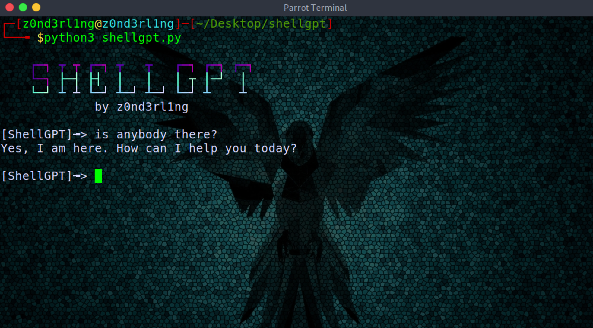

<h1>SHELLGPT</h1>

ChatCPT for shell using openai API

 

 <h3>GET STARTED</h3>

         create an <a href="https://beta.openai.com/account/api-keys">openAI API KEY</> and paste it into the script!
         
         sudo python3 shellgpt.py
